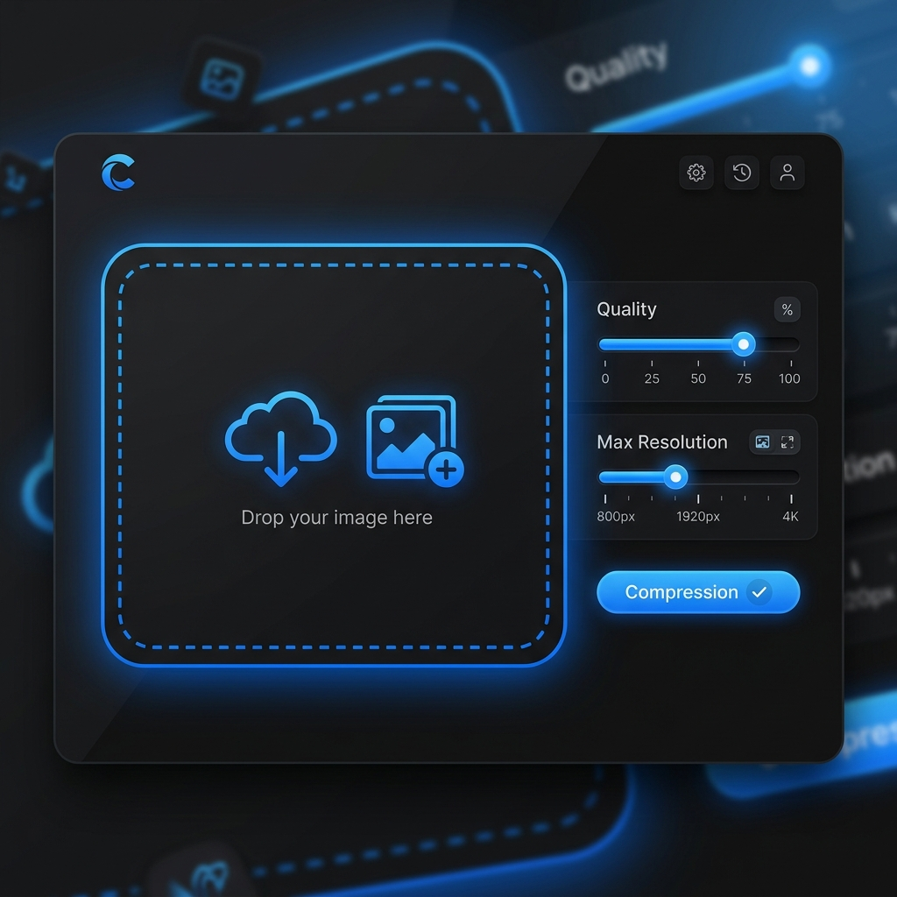

# 🖼️ Squeeze - High-Performance Image Compressor

Squeeze is a modern, privacy-first image compression tool built with Next.js and React. It operates **100% client-side**, meaning your images never touch a server. Designed for developers and creators who need fast, secure, and high-quality image optimization without the overhead of cloud processing.



## 💡 Why Squeeze?

Most online image compressors upload your files to their servers, which can be slow and raises privacy concerns. Squeeze solves this by performing all heavy lifting directly in your browser using Web Workers. This makes it:
- **Instant**: No upload/download wait times.
- **Secure**: Your data stays on your machine.
- **Cost-effective**: Perfect for static deployments on Vercel or Netlify without hitting serverless function limits.

## 🛠️ How it Works

Squeeze uses the `browser-image-compression` library to handle complex image processing tasks. By leveraging the **Canvas API** and **Web Workers**, it can compress large images in the background without freezing the UI. Users can fine-tune the compression quality and maximum resolution to find the perfect balance between file size and visual fidelity.

## ✨ Features

- **Privacy First**: All compression happens locally in your browser. No data is ever uploaded.
- **Lightning Fast**: Powered by `browser-image-compression` for near-instant results.
- **Batch Processing**: Drop in up to 50 images (max 50MB each) and compress them sequentially with a live progress queue.
- **Smart Settings**: Adjust quality, maximum resolution, and output format with real-time feedback — your preferences are remembered across sessions.
- **Cancel & Retry**: Stop an in-flight compression at any time, or retry a failed/cancelled item without re-uploading.
- **Batch ZIP Download**: Download all compressed images at once as a single ZIP archive.
- **Modern UI**: A sleek, premium dark-mode interface with a before/after compare slider and responsive design.
- **Format Support**: Compresses and converts between JPG, PNG, and WebP images seamlessly.
- **Vercel Ready**: Optimized for deployment on Vercel and edge environments.

## 🚀 Tech Stack

- **Framework**: [Next.js 16 (App Router)](https://nextjs.org/)
- **Logic**: [React 19](https://react.dev/)
- **Styling**: [Tailwind CSS 4](https://tailwindcss.com/)
- **Icons**: [Lucide React](https://lucide.dev/)
- **Compression**: [browser-image-compression](https://github.com/Donaldcwl/browser-image-compression)
- **Archiving**: [JSZip](https://stuk.github.io/jszip/)

## 🛠️ Getting Started

### Prerequisites

- Node.js 18.17 or later
- npm / yarn / pnpm

### Installation

1. Clone the repository:
   ```bash
   git clone https://github.com/YOUR_USERNAME/image-compress.git
   cd image-compress
   ```

2. Install dependencies:
   ```bash
   npm install
   ```

3. Run the development server:
   ```bash
   npm run dev
   ```

4. Open [http://localhost:3000](http://localhost:3000) in your browser.

## 📦 Deployment

The easiest way to deploy is using [Vercel](https://vercel.com/new):

```bash
npx vercel
```

## 📄 License

This project is licensed under the MIT License - see the [LICENSE](LICENSE) file for details.

---

Built with ❤️ for the performance-obsessed.
